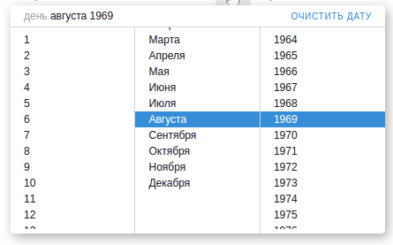

# Datepicker

Vue datepicker component. Compatible with Vue 2.x

## Requirements

- [Vue.js](https://github.com/yyx990803/vue) `^2.0.0`

## Example



## Usage

```html
<template>
  <datepicker :date="date" :required="true" :readonly="false" @datechange="doSomething">
    <i class="my-icon" />
  </datepicker>
</template>

<script>
import Datepicker from 'vue-idatepicker'

export default {
  components: {
    Datepicker
  },
  data () {
    return {
      datepickerOptions: {
        emptyDay: 'Day',
        emptyMonth: 'Month',
        emptyYear: 'Year',
        clear: 'Clear date',
        months: ['Jan', 'Feb', 'Mar', 'Apr', 'May', 'Jun', 'Jul', 'Aug', 'Sep', 'Oct', 'Nov', 'Dec'],
        startDate: new Date(1950, 5, 5),
        finishDate: new Date (2050, 5, 5),
        styles: {
          pickerWidth: '90%',
          pickerShadow: '3px 4px 18px 0px rgba(115, 115, 115, 0.6)',
          clearColor: 'blue',
          selectedBackground: 'blue',
          selectedColor: 'white',
          disabledColor: 'gray',
          placeholderColor: 'gray',
          textColor: 'black'
        }
      }
    }
  },
  methods: {
    doSomething (err, date) {
      if (err) {
        // your validation messages
      } else {
        // do something with date
      }
    }
  }
})
</script>
```

## Available props

| Prop                              | Type         | Default              | Description                                                           |
|-----------------------------------|--------------|----------------------|-----------------------------------------------------------------------|
| date                              | Number       |                      | Date value in seconds elapsed since 1 January 1970 00:00:00 UTC       |
| readonly                          | Boolean      |                      | Do not show picker, date only                                         |
| required                          | Boolean      | false                | To show asterisk                                                      |
| options                           | Object       |                      | Datepicker options                                                    |
| options.emptyDay                  | String       | 'day'                | Translation for day                                                   |
| options.emptyMonth                | String       | 'month'              | Translation for month                                                 |
| options.emptyYear                 | String       | 'year'               | Translation for year                                                  |
| options.clear                     | String       | 'clear'              | Translation for clear button                                          |
| options.months                    | Array        |                      | Translation for month names                                           |
| options.startDate                 | Date         | new Date(1897, 0, 1) | Min date                                                              |
| options.finishDate                | Date         | new Date()           | Max date                                                              |
| options.styles                    | Object       |                      | Styles for some inner parts                                           |
| options.styles.pickerWidth        | String       | '100%'               | Width of picker                                                       |
| options.styles.pickerShadow       | String       | null                 | Shadow of picker                                                      |
| options.styles.clearColor         | String       | '#358ed7'            | Color of clear button                                                 |
| options.styles.selectedBackground | String       | '#358ed7'            | Background color of selected item                                     |
| options.styles.selectedColor      | String       | '#fff'               | Color of selected item                                                |
| options.styles.disabledColor      | String       | 'gray'               | Color of disabled item                                                |
| options.styles.placeholderColor   | String       | 'gray'               | Color of stub elements                                                |
| options.styles.textColor          | String       | '#1b212b'            | Color of other text                                                   |

## Available events

| Event         | Output                  | Description                                                   |
|---------------|-------------------------|---------------------------------------------------------------|
| datechange    | Object/null, Date/null  | Emits on outside click with two arguments - error and result. |

#### Error Object
```javascript
error = {
  day: Boolean,
  month: Boolean,
  year: Boolean
}
```

## Slots

There is one default slot, where you can place icons, validations or any additional html


## License

[The MIT License](http://opensource.org/licenses/MIT)
